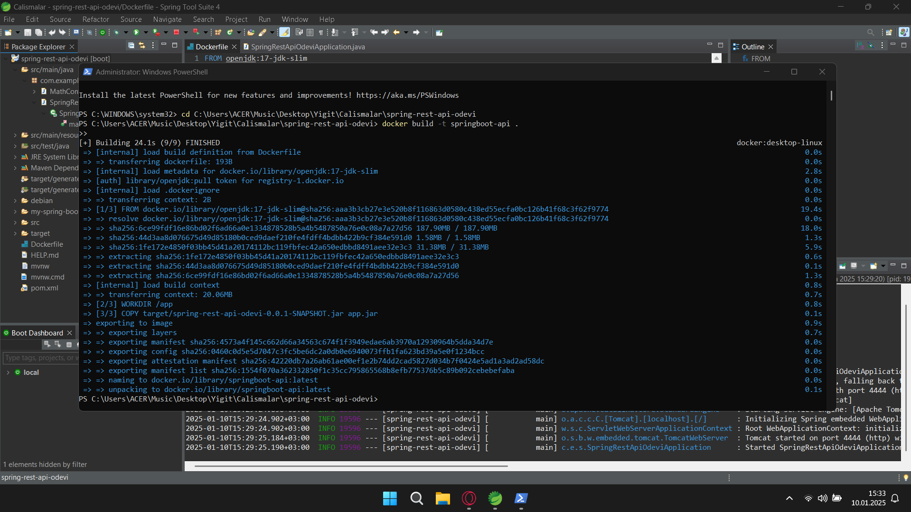
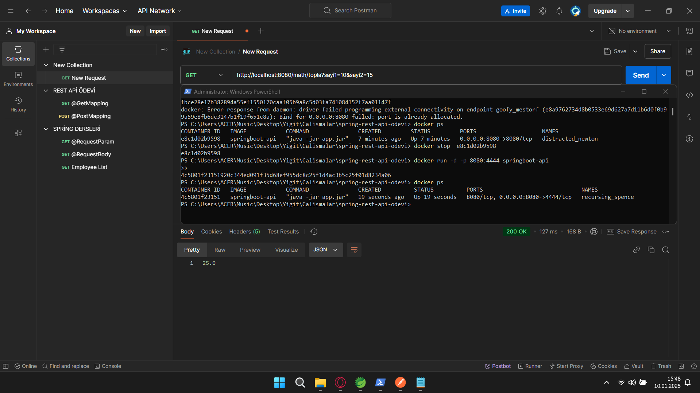
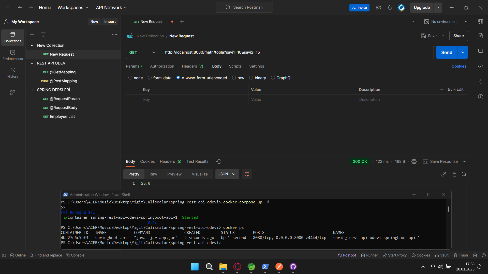

# Spring Boot REST API Docker Project

Bu proje, toplama işlemi yapan basit bir Spring Boot REST API'sinin Docker containerization örneğidir.

## Proje Yapısı

Proje, 4444 portunda çalışan bir Spring Boot uygulamasını içerir ve Docker Compose ile 8080 portuna map edilmiştir.

## Önkoşullar

- Java 17
- Docker
- Docker Compose

## Docker Image Oluşturma ve Çalıştırma

### 1. Docker Image Build

```bash
docker build -t springboot-api .
```




### 2. Container Oluşturma ve Başlatma

```bash
docker-compose up -d
```



## API Endpoint'leri

### Toplama İşlemi
- **Endpoint:** `/add`
- **Method:** GET
- **Port:** 8080 (Docker üzerinde)

## Uygulama Detayları

### Dockerfile
```dockerfile
FROM openjdk:17-jdk-slim
WORKDIR /app
COPY target/spring-rest-api-odevi-0.0.1-SNAPSHOT.jar app.jar
EXPOSE 8080
CMD ["java", "-jar", "app.jar"]
```

### Docker Compose
```yaml
services:
  springboot-api:
    image: springboot-api 
    build:
      context: C:\Users\ACER\Music\Desktop\Yigit\Calismalar\spring-rest-api-odevi\Dockerfile 
    ports:
      - "8080:4444"
    volumes:
      - ./spring-rest-api-odevi:/app
```

## Konteyner Durumunu Kontrol Etme

```bash
docker ps
```

## Notlar

- Uygulama varsayılan olarak 4444 portunda çalışır
- Docker Compose ile 8080 portuna yönlendirilmiştir
- Volume mapping ile GitHub reposundaki kodlar container ile senkronize edilmiştir
- API testleri Postman aracılığıyla gerçekleştirilmiştir
